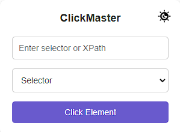
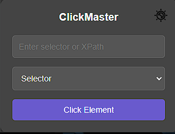

# Click Master - Chrome Extension
<p align="center">
  
</p>
Click Master is a simple Chrome extension that allows users to perform specific actions on a given website. It uses a user input to interact with elements on the webpage, based on selector types like CSS Selector, XPath, and Full XPath. The extension provides a user-friendly interface to easily select elements and trigger actions like clicking on them.

## Features
<p align="center">
  
  
</p>
- Interact with elements on any webpage using CSS Selector, XPath, or Full XPath.
- Simple and intuitive user interface.
- Dark mode option for better user experience.
- Icon and popup design for a seamless integration with Chrome.

## Installation

To install and run the extension locally:

1. **Clone the repository**:
   ```bash
   git clone https://github.com/semih-turan/Click-Master.git
2. **Navigate to the project directory**
    ```bash
    cd click-master
3. **Open Chrome and go to chrome://extensions/.**
4. **Enable Developer mode (toggle in the top right corner).**
5. **Click on Load unpacked and select the click-master folder.**
6. **The extension will now be loaded and available for use in Chrome.**

## How to Use

1. Click on the Click Master extension icon in the Chrome toolbar.

2. Enter the element's selector, XPath, or Full XPath into the input field.

3. Select the appropriate category (CSS Selector, XPath, or Full XPath) from the dropdown menu.

4. Press the Click Element button to trigger a click on the selected element.

5. You can toggle Dark Mode using the button at the top right corner of the popup.

## File Structure 

```bash
click-master/
│
├── icons/
│   ├── icon16.png
│   ├── icon48.png
│   └── icon128.png
│
├── background.js
├── content.js
├── manifest.json
├── popup.html
├── popup.js
├── popup.css
└── README.md
```

## License


This project is licensed under the MIT License. See the LICENSE file for more details. Feel free to contribute, raise issues, or provide suggestions to improve Click Master!